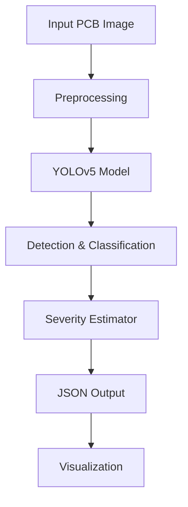

# Automated Quality Inspection System for PCB Defects

Automated visual inspection system for Printed Circuit Boards (PCBs) that detects, localizes, and classifies manufacturing defects using YOLOv5.

## Overview

Detects **6 types of PCB defects**:
1. Missing Hole - Absent holes in PCB
2. Mouse Bite - Edge defects from incomplete cutting
3. Open Circuit - Broken circuit paths
4. Short - Unintended connections
5. Spur - Unwanted copper traces
6. Spurious Copper - Excess copper material

## Architecture



## Features

- Defect detection with bounding boxes
- Multi-class classification (6 types)
- Severity assessment (Low/Medium/High)
- Defect center coordinates (x, y)
- JSON output with all metrics
- Visualization with annotated images

## Project Structure

```
scratch-and-defect-detection/
├── data/
│   ├── images/          # Train/val/test images (693 total)
│   ├── labels/          # YOLO format annotations
│   └── dataset.yaml     # Dataset config
├── src/
│   ├── train.py         # Training script
│   ├── infer.py         # Inference script
│   ├── evaluate.py      # Evaluation metrics
│   ├── severity_estimator.py
│   └── utils/
│       ├── visualization.py
│       └── metrics.py
├── models/weights/      # Trained models
└── results/             # Predictions & visualizations
```

## Installation

```bash
pip install -r requirements.txt
```

**Requirements**: Python 3.8+, PyTorch, Ultralytics, OpenCV

## Dataset

**Source**: [Kaggle PCB Defects Dataset](https://www.kaggle.com/datasets/akhatova/pcb-defects)

**Download Steps**:
1. Create Kaggle account
2. Download dataset from [Kaggle](https://www.kaggle.com/datasets/akhatova/pcb-defects)
3. Dataset is already processed (693 images, YOLO format)

**Dataset Stats**:
- Total: 693 images
- Train: 485 | Val: 138 | Test: 70
- Format: YOLO (converted from PASCAL VOC XML)

## Usage

### Training

```bash
python src/train.py --data data/dataset.yaml --epochs 50 --batch-size 8 --model s
```

### Evaluation

```bash
python src/evaluate.py --model models/weights/best.pt --data data/dataset.yaml --speed-test
```

**Metrics**: mAP@0.5, mAP@0.5:0.95, Precision, Recall, F1-score, FPS (checks results folder for results)


### Inference(to test sample PCBs)

```bash
python src/infer.py --model models/weights/best.pt --image path/to/image.jpg --output-json results/predictions/result.json --output-viz results/visualizations/result.jpg
```

**Example**:

Input:


Output:


The system detects defects, draws colored bounding boxes around them, and displays labels with defect type, confidence, and severity on a black background with white text.

**Output JSON Format**:
```json
{
  "image_path": "path/to/image.jpg",
  "defects": [{
    "defect_type": "Missing Hole",
    "confidence": 0.92,
    "bbox": [145.5, 210.3, 180.2, 245.8],
    "center": [162, 228],
    "severity": "High"
  }],
  "total_defects": 1
}
```

## Requirements

Key dependencies:
- `ultralytics>=8.0.0` (YOLOv5)
- `torch>=2.0.0`
- `opencv-python>=4.8.0`
- `numpy`, `pandas`, `matplotlib`, `seaborn`

See `requirements.txt` for complete list.

## References

- [YOLOv5 Documentation](https://docs.ultralytics.com/)
- [Kaggle Dataset](https://www.kaggle.com/datasets/akhatova/pcb-defects)
- [Reference Implementation](https://github.com/MBDNotes/YOLOv5_PCB_Defects_Detection)

## License

Educational and research purposes.
